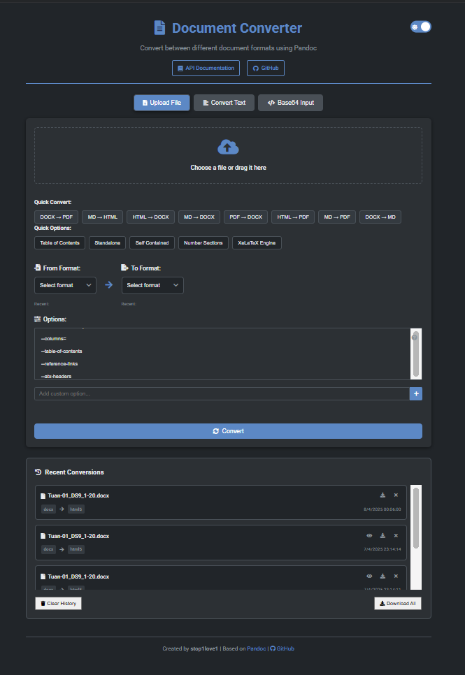

# Document Converter

A powerful web application for converting between various document, image, and text formats.



## Features

- **File Conversion**: Convert between document formats (DOCX, PDF, MD, HTML, etc.)
- **Image Conversion**: Convert between image formats with quality adjustments
- **Text Conversion**: Direct conversion of text content
- **Base64 Conversion**: Convert Base64 data to target formats
- **Advanced Options**: Customize conversion with various options
- **Conversion History**: Save and download conversion history
- **Dark/Light Mode**: User-friendly interface with togglable themes
- **Drag & Drop**: Support for dragging and dropping files
- **Preview**: Preview files and results before downloading
- **Keyboard Shortcuts**: Enhance user experience

## Requirements

- Python 3.8+
- Flask
- Pandoc
- ImageMagick
- Other Python libraries listed in `requirements.txt`

## Installation

1. Clone repository:
```bash
git clone https://github.com/stop1love1/document-converter.git
cd document-converter
```

2. Create and activate virtual environment:
```bash
python -m venv venv
source venv/bin/activate  # On Windows: venv\Scripts\activate
```

3. Install dependencies:
```bash
pip install -r requirements.txt
```

4. Install Pandoc and ImageMagick (if not already installed):
   - Pandoc: [https://pandoc.org/installing.html](https://pandoc.org/installing.html)
   - ImageMagick: [https://imagemagick.org/script/download.php](https://imagemagick.org/script/download.php)

## Running the App

1. Start the Flask application:
```bash
python app.py
```

2. Open your browser and go to:
```
http://localhost:5000
```

## Usage

- **File Conversion**: Upload file → Select formats → Add options → Convert
- **Image Conversion**: Upload image → Select target format → Adjust quality → Convert
- **Text Conversion**: Enter text → Select formats → Convert
- **Base64 Conversion**: Enter Base64 data → Select formats → Convert

## Keyboard Shortcuts

- **Alt + F**: File tab
- **Alt + T**: Text tab
- **Alt + B**: Base64 tab
- **Alt + C**: Activate conversion
- **Alt + K**: Show/hide shortcuts
- **Alt + D**: Toggle dark/light mode

## API

API documentation available at `/api/docs/`

## Technologies

- **Backend**: Python, Flask
- **Frontend**: HTML, CSS, JavaScript
- **Conversion Tools**: Pandoc, ImageMagick

## License

MIT License - see [LICENSE](LICENSE) for details.

## Contact

GitHub: [https://github.com/stop1love1/document-converter](https://github.com/stop1love1/document-converter)
